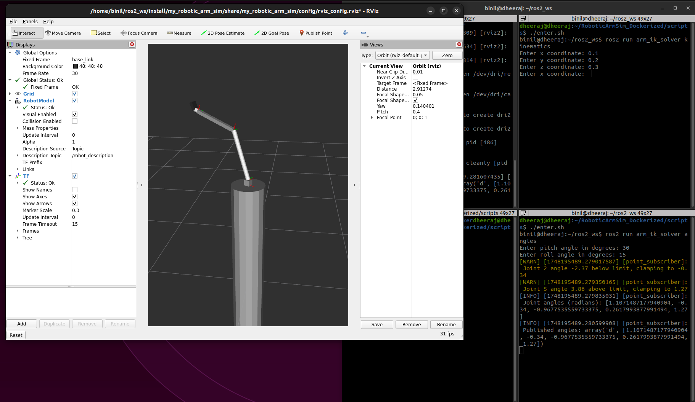

# Inverse Kinematics

This repository contains the arm_ik_solver package which calculates the angles necessary to reach a given point in 3D space in the given simulation.

---

## Repository Setup

### 1. Clone the Simulation Repository (with submodules)

```bash
git clone --recurse-submodules git@github.com:RealDev05/RoboticArmSim_Dockerized.git
```

> **Note**: If you forget the `--recurse-submodules` flag, run:
```bash
git submodule update --init --recursive
```

---

### 2. Clone the Inverse Kinematics Repository

Clone the following repository to a **different folder**:

```bash
git clone git@github.com:zn-har/Inverse_kinematics.git
```

Navigate into the cloned folder:

```bash
cd Inverse_kinematics/src
```

Copy the `arm_ik_solver` folder into the `src` directory of your workspace inside `RoboticArmSim_Dockerized`:

```bash
cp -r arm_ik_solver /path/to/RoboticArmSim_Dockerized/workspace/src/
```

---

## Build the Docker Image

```bash
cd /path/to/RoboticArmSim_Dockerized
sudo docker build -t arm_simulation .
```

---

## Run the Simulation

### 1. Start the Docker Container

```bash
cd scripts
./run.sh
```

### 2. Open a New Terminal and Enter the Container

```bash
./enter.sh
```

> **Stopping the Container:**  
This happens automatically with `run.sh`, but if needed manually, run:
```bash
./stop.sh
```

---

## Execution

### Launch the Simulation

```bash
ros2 launch my_robotic_arm_sim sim_launch.py
```

### Test the Controls

**In Terminal 1:**
```bash
ros2 run arm_ik_solver kinematics
```

**In Terminal 2:**
```bash
ros2 run arm_ik_solver angles
```

Then:

- Enter the **required coordinates** when prompted in Terminal 1.
- Enter the **pitch and roll** when prompted in Terminal 2.

---

## Notes

- Make sure you have Docker installed and accessible to run these commands.
- The ROS 2 environment inside the container is based on Humble Hawksbill.
- This setup allows for modular development and testing of simulation and control logic in isolated Docker environments.


## Screenshot

